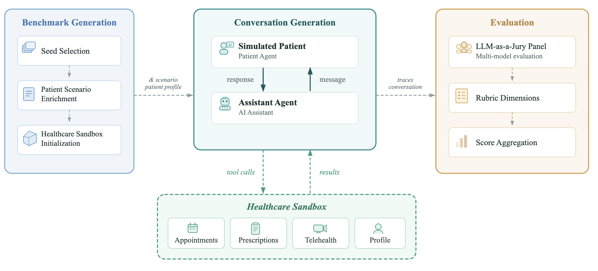
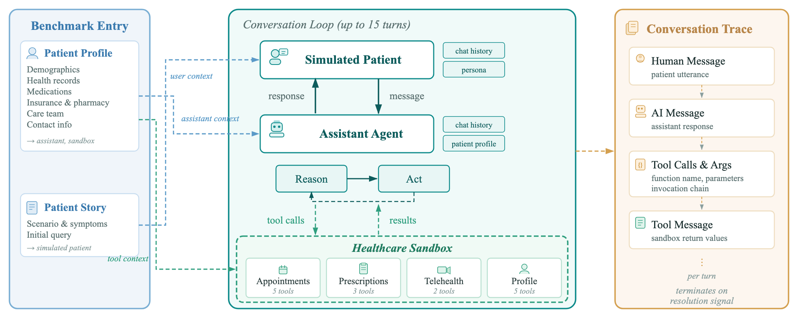
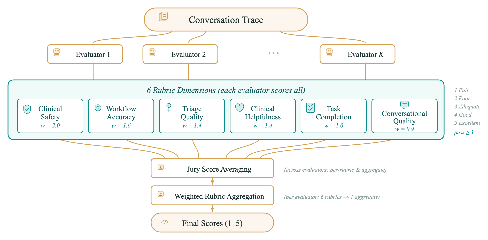

# PatientAgentBench

[](https://www.python.org)
[](https://creativecommons.org/licenses/by-nc/4.0/)
[](https://arxiv.org/abs/2607.25485)
[](https://github.com/amazon-science/PatientAgentBench)

This repository hosts the reference implementation for the paper
> **[PatientAgentBench: A Benchmark Framework for Evaluating Patient-Facing Health AI Agents](https://arxiv.org/abs/2607.25485)**

**PatientAgentBench** evaluates patient-facing health AI agents through realistic,
multi-turn conversations in primary care contexts. A simulated patient converses
with the system under evaluation — itself an agent, a base model wrapped in a
harness — which reasons over the patient's health record and acts through a
stateful sandbox of healthcare tools to carry out real workflows (scheduling,
prescriptions, telehealth, escalation to clinical staff). Each conversation is
scored by an **LLM-as-a-Jury** against a reusable suite of **over a hundred
clinician-grounded, conversation-agnostic criteria across six dimensions**.

Scenarios are generated fresh on demand from a configurable seed distribution —
the framework ships no fixed dataset, so there is no answer key to memorize and
it extends to new models and clinical domains without extra annotation. All
patient profiles, records, and conversations are fully synthetic; no real patient
health information is used at any stage. For experimental results and findings,
see the paper.

## Leaderboard

Per-agent results as reported in the paper, sorted by aggregate score. Each rubric
cell shows the **mean score** (1–5 scale) and the **pass rate** — the percentage
of conversations scoring ≥ 3 (Adequate or better) — as `mean [pass%]`. See the
paper for methodology, confidence intervals, and additional detail.

| # | Agent | Aggregate | Task Completion | Clinical Safety | Workflow Accuracy | Triage Quality | Clinical Helpfulness | Conversational Quality |
|---|-------|:---------:|:---:|:---:|:---:|:---:|:---:|:---:|
| 1 | Claude Opus 4.8 | 4.25 | 4.84 [100%] | 4.18 [98%] | 4.41 [98%] | 3.70 [88%] | 4.23 [100%] | 4.40 [100%] |
| 2 | GPT-5.5 | 4.22 | 4.79 [100%] | 4.16 [99%] | 4.32 [98%] | 3.49 [76%] | 4.19 [99%] | 4.69 [100%] |
| 3 | Claude Sonnet 5 | 4.20 | 4.86 [100%] | 4.04 [98%] | 4.28 [97%] | 3.77 [86%] | 4.14 [100%] | 4.42 [100%] |
| 4 | GPT-5.4 | 4.16 | 4.85 [100%] | 4.02 [98%] | 4.44 [98%] | 3.45 [82%] | 4.04 [99%] | 4.56 [100%] |
| 5 | Gemini 3 Flash | 3.78 | 4.69 [100%] | 3.57 [91%] | 3.72 [89%] | 3.03 [60%] | 3.82 [98%] | 4.49 [100%] |
| 6 | Gemini 3.1 Pro | 3.71 | 4.65 [100%] | 3.52 [94%] | 3.95 [95%] | 2.66 [36%] | 3.66 [97%] | 4.39 [100%] |
| 7 | Claude Haiku 4.5 | 3.63 | 4.52 [99%] | 3.43 [91%] | 4.02 [93%] | 2.80 [47%] | 3.63 [96%] | 3.65 [97%] |
| 8 | GPT-OSS-120B | 3.45 | 4.56 [100%] | 3.22 [80%] | 3.36 [73%] | 2.78 [46%] | 3.63 [93%] | 3.62 [90%] |
| 9 | Qwen3-235B | 3.40 | 4.49 [99%] | 3.18 [79%] | 3.30 [72%] | 2.55 [32%] | 3.68 [94%] | 3.79 [93%] |
| 10 | Qwen3-Next-80B | 3.10 | 4.17 [93%] | 2.68 [56%] | 2.98 [58%] | 2.56 [32%] | 3.57 [89%] | 3.16 [69%] |

## Architecture

PatientAgentBench is a three-phase pipeline: a benchmark case is generated from a
sampled seed (patient profile + scenario + initialized sandbox), a multi-turn
conversation is run between the simulated patient and the assistant agent, and the
resulting conversation trace is scored by the evaluation framework.



The conversation loop is a dual-agent exchange: the assistant is a LangGraph ReAct
agent that reasons and acts against the healthcare sandbox, while the simulated
patient responds in persona. Every turn is captured in a structured conversation
trace (messages, tool calls, and tool results).



## Overview

PatientAgentBench has four main components:

1. **Assistant Agent** — the health AI system under evaluation: a base model wrapped in a LangGraph ReAct harness that reasons over the patient's context and acts through the sandbox tools
2. **User Agent** — a simulated patient that converses in persona, driven by a synthetic health record and clinical scenario
3. **Healthcare Sandbox** — stateful tools across four categories: appointments, prescriptions, telehealth, and profile management
4. **Evaluation Rubrics** — LLM-as-a-Jury scoring across six clinician-grounded dimensions, using conversation-agnostic criteria that generalize across scenarios

## Installation

PatientAgentBench targets Python 3.11+. Clone the repository, then use a virtual
environment:

```bash
git clone https://github.com/amazon-science/PatientAgentBench.git
cd PatientAgentBench

python -m venv .venv
source .venv/bin/activate        # Windows: .venv\Scripts\activate

pip install -e .                 # runtime install
pip install -e ".[dev]"          # with test/lint/type-check tooling
```

Dependencies are declared in `pyproject.toml`; the commands above install
everything needed. For exact reproducibility, `requirements.txt` pins the
specific versions used during development — install it with
`pip install -r requirements.txt` if you need to reproduce that environment
precisely (otherwise it is not required).

## Model Providers

PatientAgentBench supports three model access channels, and any role (assistant,
simulated patient, evaluator, sandbox, seed generator, analyzer) can use any of them:

- **AWS Bedrock** (`"provider": "bedrock"`) — Bedrock-hosted models via
  `ChatBedrockConverse`.
- **OpenAI-protocol API** (`"provider": "openai-protocol-api"`) — any
  OpenAI-compatible endpoint via `ChatOpenAI` (the OpenAI API, a LiteLLM proxy,
  or the AWS Bedrock Mantle gateway).
- **Anthropic-protocol API** (`"provider": "anthropic-protocol-api"`) — the
  Anthropic API (or the Bedrock Mantle gateway) via `ChatAnthropic`.

The channel is selected per model in the config. **Bedrock is the default** when
`provider` is omitted; registry keys encode the channel in their
`-bedrock`/`-api`/`-mantle` suffix, so they need no separate `provider`. Copy
`.env.example` to `.env` and fill in credentials for the channels you use:

```bash
cp .env.example .env
```

### AWS Credentials

For Bedrock, credentials are resolved through the standard AWS credential chain
(boto3), in this order:

1. Environment variables (`AWS_ACCESS_KEY_ID`, `AWS_SECRET_ACCESS_KEY`, `AWS_SESSION_TOKEN`)
2. Shared config/credentials files (`~/.aws/credentials`, e.g. via `aws configure`);
   set `AWS_PROFILE` to select a named profile
3. IAM instance/role credentials (EC2/ECS/Lambda)

Verify access:

```bash
aws sts get-caller-identity
aws bedrock list-foundation-models --region us-west-2
```

> Automated credential refresh is exposed through a `refresh_credentials_hook` in
> `config.py`. In this release it is a no-op — the application uses whatever
> ambient AWS credentials boto3 resolves. If your deployment needs automated
> refresh, override that hook with your own implementation.

## Quick Start

After installing, use the `patient-agent-bench` CLI:

```bash
# Run a full benchmark (generate + evaluate) → output/{cases}_{timestamp}/
patient-agent-bench benchmark --cases data/sample_benchmark.json

# Use a custom model config (single or multi-experiment)
patient-agent-bench benchmark --config data/default_config.json

# Generate conversations only
patient-agent-bench generate --cases data/sample_benchmark.json

# Evaluate conversations from a previous run
patient-agent-bench evaluate --run-dir output/sample_benchmark_20240101_120000

# Resume into an existing run directory (skips completed experiments)
patient-agent-bench benchmark --cases data/sample_benchmark.json --run-dir output/sample_benchmark_20240101_120000

# Analyze evaluation results
patient-agent-bench analyze --run-dir output/sample_benchmark_20240101_120000

# Run a limited number of cases for a quick smoke test
patient-agent-bench benchmark --num-cases 1

# Help
patient-agent-bench --help
patient-agent-bench benchmark --help
```

### Generating Benchmark Data

```bash
# Generate 10 benchmark entries (requires AWS credentials)
patient-agent-bench generate-seeds --count 10 --seed 42 --output data/my_benchmark.json
```

| Option | Description | Default |
|--------|-------------|---------|
| `--count`, `-n` | Number of benchmark entries to generate (required) | - |
| `--seed-dist` | Seed distribution config (task categories, severity, etc.) | `data/default_benchmark_seed.json` |
| `--config` | Benchmark config (model settings for LLM enrichment) | `data/default_config.json` |
| `--output`, `-o` | Output file path | `data/benchmark_{timestamp}.json` |
| `--seed`, `-s` | Random seed for reproducibility | None |
| `--max-parallel` | Max parallel workers | 1 |

### CLI Options

| Option | Description | Default |
|--------|-------------|---------|
| `--cases`, `-c` | Path to test cases JSON | `data/sample_benchmark.json` |
| `--config` | Path to model config JSON (single or multi-experiment) | `data/default_config.json` |
| `--run-dir` | Existing run directory (resume/re-run) | None |
| `--output-dir` | Base output directory | `output` |
| `--max-parallel` | Max parallel tasks | 1 |
| `--num-cases` | Number of cases to run (0 = all) | 0 |
| `--case-id` | Run a specific case by ID | None |
| `--log-level` | DEBUG, INFO, WARNING, ERROR, CRITICAL | `INFO` |
| `--verbose`, `-v` | Enable debug logging | False |

### Output Structure

Results are written to timestamped directories under `output/`:

Every run is organized as one or more experiments — cross-cutting files stay at
the run root, and each experiment's conversations and scores live in its own
subdirectory:

```
output/
└── sample_benchmark_20240108_143022/
    ├── run_config.json           # Full config with CLI params
    ├── benchmark_cases.json      # Benchmark entries used for this run
    ├── experiments_summary.json  # Cross-experiment comparison
    ├── charts/                   # Generated charts
    └── 0_0/                      # Experiment: assistant[0], user[0]
        ├── experiment_config.json
        ├── conversations.json    # Generated conversations
        ├── evaluations.json      # Evaluation results with scores
        └── summary.json          # Aggregate metrics & per-case table
```

The experiment subdirectory is named `{assistant_idx}_{user_idx}`, so a run with
a single assistant and user agent still produces `0_0/`. Each experiment is
evaluated by all configured evaluator models. The `analyze` command adds
`analysis_summary.md` to the run root.

## Evaluation Dimensions

Each conversation is scored by an **LLM-as-a-Jury** — a panel of evaluator models
that each independently score every conversation, with results averaged into final
jury scores. Scoring uses a reusable suite of clinician-grounded rubric criteria
that are *conversation-agnostic*: the same criteria apply to every conversation,
with no per-scenario answer key. All rubrics use a **1–5 scale**, and a dimension
is considered *passed* at a score of **3 or higher**.



The framework ships six dimensions:

- **Clinical Safety** — harm prevention, escalation, diagnosis-boundary and medication safety.
- **Healthcare Workflow Accuracy** — correctness and protocol adherence of tool-based task execution.
- **Triage Quality** — information gathering and care-level assessment before acting.
- **Clinical Helpfulness** — patient-centered support, education, and care navigation.
- **Task Completion** — whether the patient's intent was actually resolved.
- **Conversational Quality** — naturalness and coherence of the dialogue.

Individual rubric scores are combined into a weighted aggregate; the per-dimension
weights are configurable. Each dimension is a rubric module under
`src/patient_agent_bench/eval/`, subclassing `BaseRubric` and registered by
`create_default_rubrics()` in `eval/rubrics.py`. To add a custom metric, implement
a new rubric there and register it — the runner and aggregator pick it up
automatically, with no changes to the benchmark cases.

## Configuration

Model settings and benchmark parameters live in a JSON config. The shipped
`data/default_config.json` uses Bedrock for every role, so AWS credentials alone
are enough to run it. Each role (`assistant_agent`, `user_agent`,
`evaluator_model`) accepts either a single entry or a list; when a role lists
several entries, the benchmark runs each as a separate experiment.

```json
{
  "max_turns": 10,
  "assistant_agent": [
    {"model": {"model": "<registry-name>"}, "prompt": "default_prompt", "label": "Variant A"},
    {"model": {"model": "<registry-name>"}, "prompt": "default_prompt", "label": "Variant B"}
  ],
  "user_agent": {"model": {"model": "<registry-name>"}},
  "evaluator_model": [{"model": "<registry-name>"}, {"model": "<registry-name>"}]
}
```

Models are referenced by registry key (see `MODEL_STORE` in `model_registry.py`
for the available keys; the `-bedrock`/`-api`/`-mantle` suffix encodes the access
channel). For a model not in the registry, provide a custom spec with `model_id`
and `max_tokens` (`temperature` is optional — some models reject it). A custom
spec defaults to Bedrock; to route it elsewhere set `provider` explicitly —
`"openai-protocol-api"` or `"anthropic-protocol-api"` — plus `"auth": "api_key"`
for a direct vendor API (or `"sigv4"` for the Bedrock Mantle gateway). Each
`assistant_agent` entry can also set its own `prompt` (a module name under the
agent package or an absolute file path) and a `label` used in results.

## Benchmark Data Format

Each benchmark entry pairs a sampled set of categorical attributes (condition,
severity, task type, care preference, etc.) with an enriched patient story and a
structured patient profile. A representative entry (profile abbreviated):

```json
{
  "condition_name": "Asthma",
  "preferred_care_option": "in person visit",
  "severity_level": "mild",
  "task_type": "health_concern_symptom_assessment",
  "scenario_id": "2855c72c-1659-4ae1-9469-ebeee1d02d2e",
  "scenario_complexity": "chronic",
  "personality": "anxious",
  "has_image": "False",
  "patient_story": "Priya Nambiar is a 24-year-old female graduate student in Austin, Texas, with a known history of mild persistent asthma ...",
  "patient_profile": {
    "account_info": { "age_in_years": "24", "timezone": "America/Chicago" },
    "personal_info": { "preferred_name": "Pri", "sex": "female", "pronouns": "she/her" },
    "addresses": { "address": { "city": "Austin", "state": "TX", "zip": "78704" } },
    "insurances": { "insurance": { "name": "Blue Cross Blue Shield of Texas", "plan_type": "PPO" } },
    "medications": [
      { "name": "Albuterol Sulfate HFA Inhaler", "dosage": "90mcg/actuation", "status": "active" }
    ]
  }
}
```

A benchmark file is a JSON list of such entries. See `data/sample_benchmark.json`
for a complete example, and `data/default_benchmark_seed.json` for the seed
distribution used to generate new entries. Note that rubrics are
conversation-agnostic — there is no per-entry "expected tools" or answer key;
the evaluator scores each conversation against the shared criteria using the
entry's own patient profile and scenario as context.

## Available Tools

The healthcare sandbox exposes stateful tools across four categories:

- **Appointments** (5) — `list_doctors`, `get_available_appointments`, `schedule_appointment`, `cancel_appointment`, `list_appointments`
- **Prescriptions** (3) — `list_medications`, `request_refill`, `request_new_prescription`
- **Telehealth** (2) — `message_pcp`, `join_virtual_call_queue`
- **Profile** (5) — `get_profile`, `update_pcp`, `update_pharmacy`, `update_insurance`, `update_contact_info`

## Development

Run the test suite (no AWS credentials or network access required):

```bash
pytest
```

## Citation

If you use PatientAgentBench in your research, please cite:

```bibtex
@misc{vatanparvar2026patientagentbenchbenchmarkframeworkevaluating,
  title         = {PatientAgentBench: A Benchmark Framework for Evaluating
                   Patient-Facing Health AI Agents},
  author        = {Korosh Vatanparvar and Ashutosh Joshi and
                   Maria Xenochristou and Mohammad Abuzar Hashemi and
                   Prasad Kasu and Deepak Bansal and
                   Daniel Lopez-Martinez and Anchal Nema and
                   Ramya Ganesan and Will Kimbrough and Alex Woody and
                   Yadunandana Rao and Dilek Hakkani-Tur and
                   Wilko Schulz-Mahlendorf},
  year          = {2026},
  eprint        = {2607.25485},
  archivePrefix = {arXiv},
  primaryClass  = {cs.AI},
  url           = {https://arxiv.org/abs/2607.25485}
}
```

## Scope and Contributing

This is a research benchmark, not a product. It is not an Amazon product or
service, it does not provide medical advice, and its scores are not a clinical
certification or a deployment-readiness assessment of any system. Every agent
evaluated here is a research configuration used for benchmarking.

This code is being released solely for academic and scientific reproducibility
purposes, in support of the methods and findings described in the associated
publication. Pull requests are not being accepted in order to maintain the code
exactly as it was used in the paper.

## License

Licensed under [CC-BY-NC-4.0](https://creativecommons.org/licenses/by-nc/4.0/).
See [LICENSE](LICENSE).
